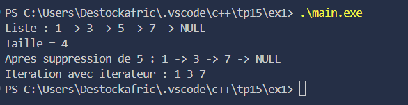
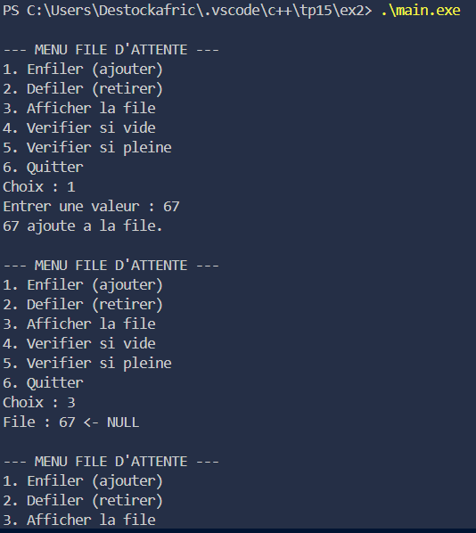
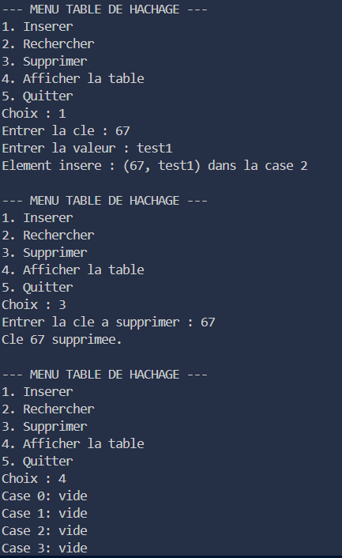
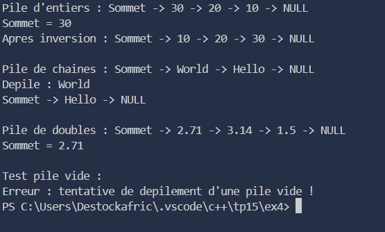

### TP C++ – Structures de Donnees Dynamiques et Orientes Objet

---

### Exercice 1 – Liste Chainee

#### Objectif
Mettre en pratique la gestion dynamique de la mémoire et la manipulation de **listes chaînées** en C++, tout en appliquant les concepts de **programmation orientée objet**.

#### Description
Implémentation d’une liste chaînée dynamique avec ajout, suppression et affichage des éléments.  
La structure permet de parcourir la liste grâce à un itérateur personnalisé et de calculer la taille de la liste.  

#### Fonctionnalités
- Ajouter un élément au **début** ou à la **fin** de la liste.  
- Supprimer un élément par valeur.  
- Parcours de la liste avec itérateur.  
- Calcul de la **taille** de la liste.  
- Libération automatique de la mémoire via le destructeur.  

---

### Exercice 2 – File Dynamique (Queue)

#### Objectif
Comprendre et implémenter le comportement **FIFO** (First In First Out) avec une **file dynamique** en C++, en gérant correctement les exceptions.  

#### Description
La file est gérée dynamiquement avec une liste chaînée.  
L’utilisateur peut ajouter et retirer des éléments via une interface textuelle interactive.  

#### Fonctionnalités
- `enfiler()` : ajouter un élément à la file.  
- `defiler()` : retirer le premier élément de la file.  
- Vérifier si la file est vide ou pleine.  
- Gestion d’exceptions sur tentative de retrait d’une file vide.  
- Affichage de l’état actuel de la file.  

---

### Exercice 3 – Table de Hachage

#### Objectif
Mettre en œuvre une **table de hachage** avec résolution de collisions par chaînage pour stocker et rechercher efficacement des paires clé/valeur.  

#### Description
La table utilise une fonction de hachage simple `clé % taille_table`.  
Chaque "case" de la table contient une liste chaînée pour gérer les collisions.  

#### Fonctionnalités
- `inserer(cle, valeur)` : ajout d’une paire clé/valeur.  
- `rechercher(cle)` : recherche d’une valeur par clé.  
- `supprimer(cle)` : suppression d’une clé existante.  
- Affichage de la table avec les listes de collision.  
- Possibilité de redimensionnement dynamique (optionnel).  

---

### Exercice 4 – Pile Générique (Template)

#### Objectif
Comprendre l’utilisation des **templates** pour créer une **pile générique** (LIFO) et manipuler différents types de données.  

#### Description
La pile permet d’empiler et dépiler des éléments tout en respectant le principe LIFO.  
Elle gère les exceptions lors du dépilement d’une pile vide et propose une fonction pour inverser la pile.  

#### Fonctionnalités
- `empiler(element)` : ajouter un élément au sommet.  
- `depiler()` : retirer l’élément du sommet.  
- `sommet()` : consulter l’élément au sommet sans le retirer.  
- `estVide()` : vérifier si la pile est vide.  
- `inverser()` : inverser l’ordre des éléments.  
- Support de multiples types (`int`, `string`, `double`) grâce aux templates.  
- Gestion d’exceptions sur dépilement de pile vide.  

